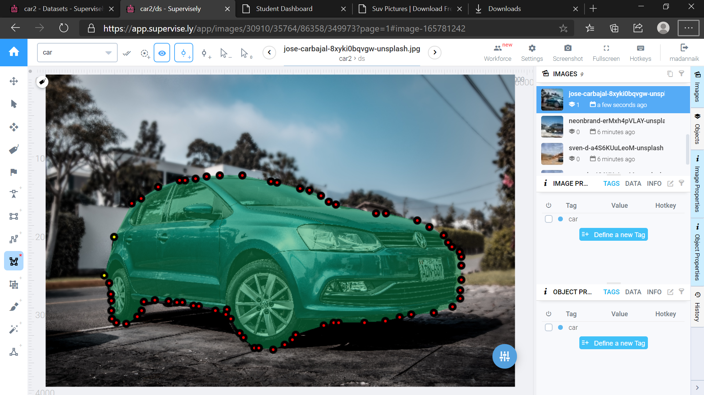
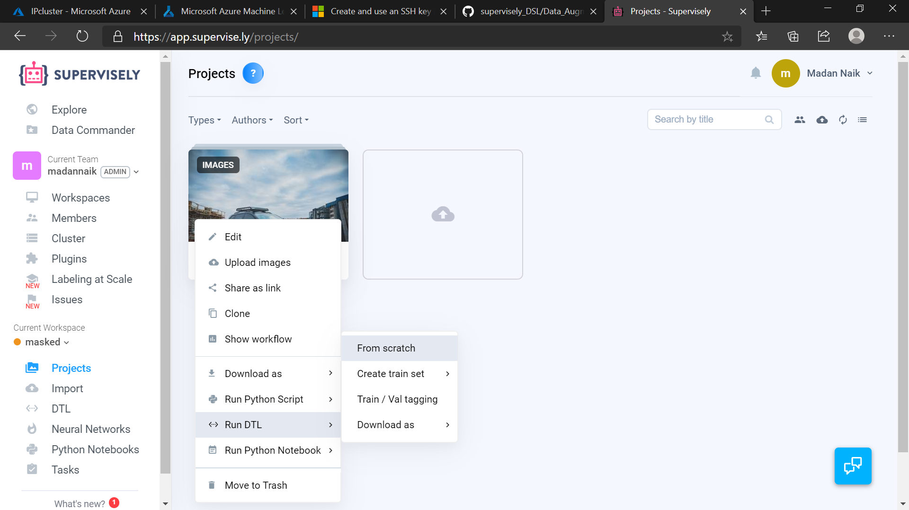
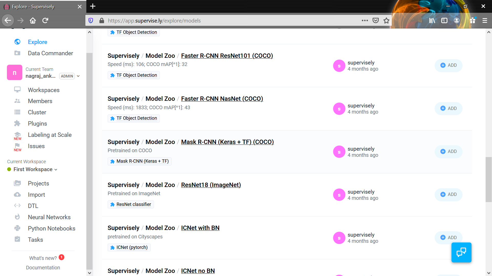
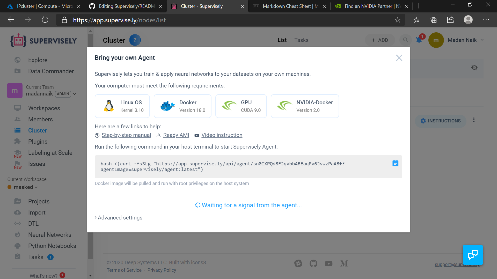
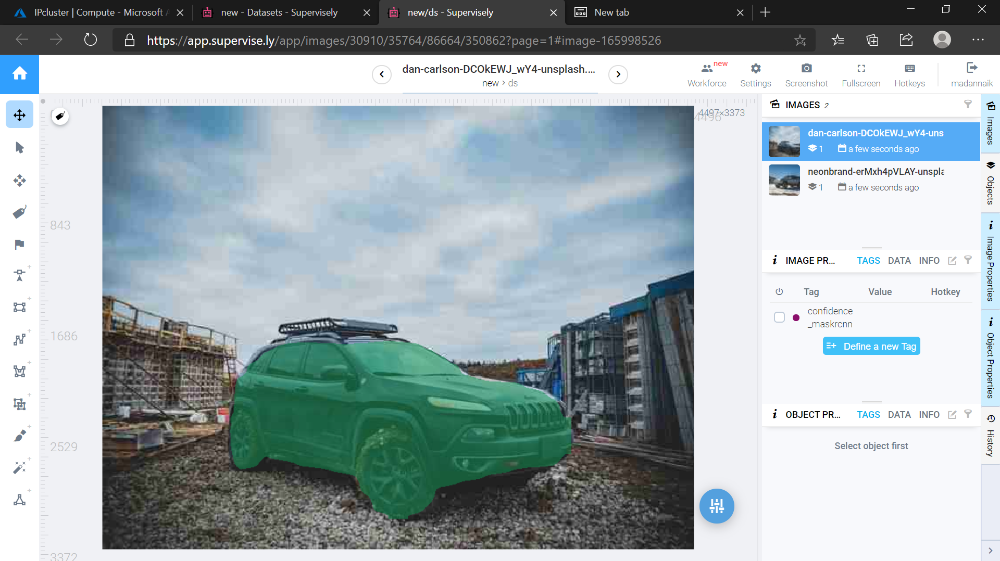
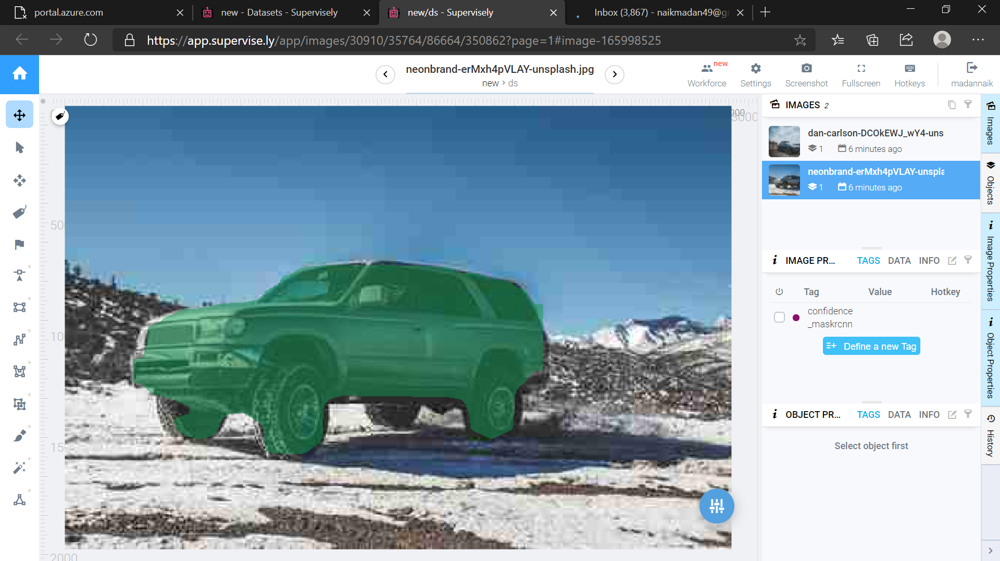

### This repo holds the demonstartion of how to use supervisley to implement a Deep learning model with no code!!!
#### Pre-requisites 
1. An account in supervisley.[click here to sign up](https://app.supervise.ly/signup)
2. A cloud instance with GPU(CUDA support).[In any cloud platform or your own laptop/PC]
   > NOTE:- The GPU instance should have CUDA support

---
### What basically supervisley do???
    Supervisely is a powerful platform for computer vision development, where individual researchers and large teams can annotate and experiment with datasets and neural networks.It helps both for both expertise and novice to build the neural network model with better accuracy!!!

---
## Things to do in supervisely
1. Create a workspace in supervislely

2. Import the dataset in the workspace you created.Its just drag and drop files in the import area and give a name to yours dataset and click import!!

3. It's ok with miniumum data(like 5-6 images).click on the images in the dataset it will open a editor for you to segment the images using some special tools.Now if you want to segment the object you want to detect,click on add polygon icon and place the polygon point on borders of the objects!!(like in the image shown below)

4.Once your done with segmenting images,Go back to you workpsace Click the drop down menu in the dataset folder and click on Run DTL and click train/Val Tagging.It will create training set and validator set of data for training.

5. Now go to Explore->Models there you can find the pre trained models with their weight(U can choose any weight of your choice but the example over here is about Masked-RCNN).
Scroll down u can find the weight of Maked-RCNN click on that and press clone to add it to your workspace!!

6. Before we train,we need to provide resources for training.Go to cluster and press "add" button it will provide with the details of minimum requirements of the system to train model.Cross check the minium requirements in the system and copy the link and paste it in your linux terminal.Then the agent wil be ready for training!!

7. click on neural network,over there you will find the Maked rcnn model which u have cloned before.Click on train and then provide the dataset(which u have done segment and train/val tagging) and give a name to your model and click run.
It takes some time based on your system and when the training is over the model will be saved with name you have give while training!!!
Cool,,now u can test your model!!!

### Result of the above trained model!!

